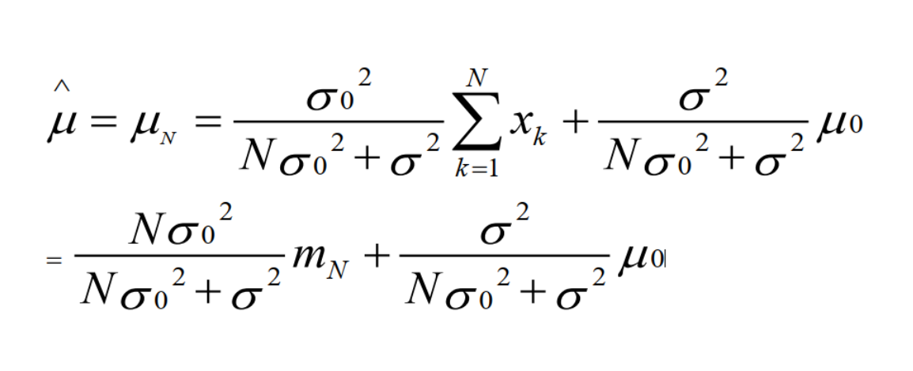
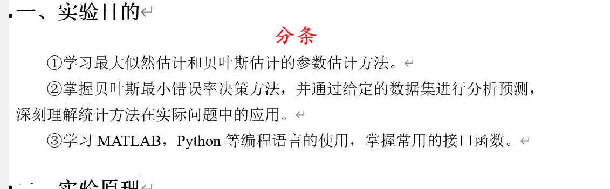
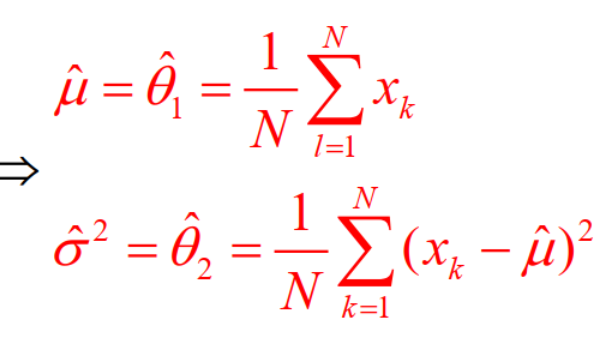
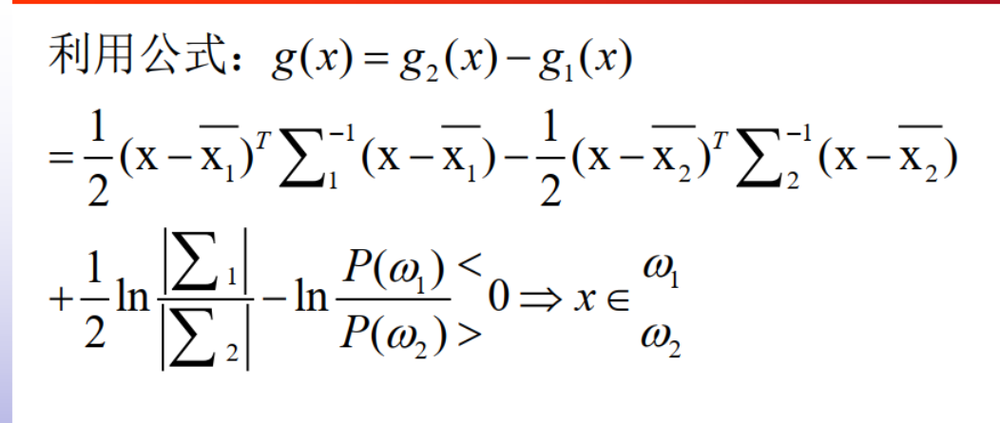
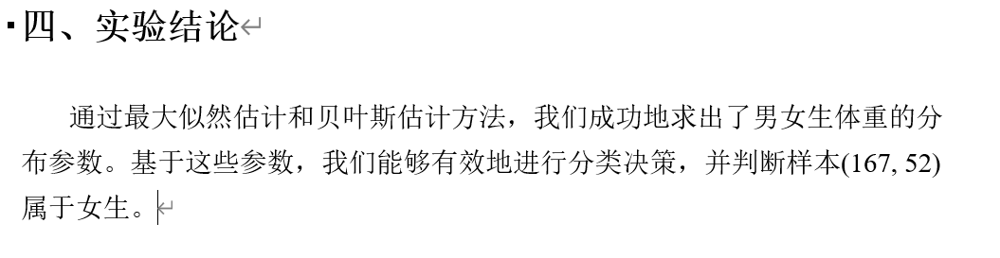

# AI_VI
 模式识别

## 项目结构

```
E:/GitHub/AI_VI/
│
├── 1.BayesianClassifier/        # 贝叶斯分类器
│   ├── README.md                # 贝叶斯分类器实验描述文件
│   ├── data/                    # 存放原始数据的目录
│   └── main.py                  # 贝叶斯分类器代码
│
├── 2.BP_SVM/                    # BP&SVM 实验部分
│   ├── README.md                # BP&SVM 实验描述文件
│   ├── data/                    # 存放原始数据的目录
│   └── main.py                  # BP & SVM 代码
│
└── 3.EM/                        # 高斯混合模型与图像处理实验
    ├── 3.1EM/                   # 初始EM模型部分
    ├── 3.2fishdis/              # 基于EM模型的鱼类图像分割实验
    │   ├── result/              # 保存分割与聚类结果的目录
    │   ├── main.py              # 主程序文件
    │   ├── data/                # 数据目录，包含原始图片与模型
    │   ├── README.md            # 该部分的说明文件
    └── 实验结果汇总/             # 所有实验的最终结果汇总目录
        ├── 任务1/               # 任务1的实验结果
        ├── 任务2/               # 任务2的实验结果
        └── README.md            # 最终实验结果的描述
```


## 1.贝叶斯分类器

### 实验目的

1. 通过贝叶斯分类器实验掌握先验概率、似然函数、后验概率等概念。
2. 学习如何使用最大似然估计和最大后验估计来估计模型参数。
3. 掌握贝叶斯决策的基本步骤和应用场景。

### 实验原理与公式

- 贝叶斯公式用于结合先验知识与样本数据来对样本分类。
- 参数估计中，采用了最大似然（MLE）和最大后验（MAP）的方法。
- 实验中通过男女生的体重和身高数据，生成对应的概率分布进行分类。

**公式说明**：

贝叶斯参数估计、最大后验参数估计及贝叶斯决策相关公式见下图：



### 数据来源

- 数据来自网络，包括最新的人体身高体重分布数据。
  - [最新国人体质数据 (qq.com)](https://new.qq.com/rain/a/20201223A066XX00)
  - [第五次国民体质监测公报 (sport.gov.cn)](https://www.sport.gov.cn/n315/n329/c24335066/content.html)

### 实验结论

1. 数据呈现较好的正态分布。
2. 使用最大似然与最大后验两种估计方法获得的参数在相应数据集下有相似性。
3. 贝叶斯决策的准确性与先验的选择密切相关。

### **文书修改**



按照实验里的要求 写实验目的


[[公式识别 (simpletex.cn)](https://simpletex.cn/ai/latex_ocr)]()

贝叶斯参数估计


最大后验参数估计



贝叶斯决策



### 

三点结论：

1、男女生的直方图分布近似符合正态

2、最大似然估计的参数，贝叶斯估计假设先验方差下的参数估计

3、贝叶斯决策，选取什么样的先验分布，给一个测试样本分类的结果

## 2.BP&SVM

### 项目概述

BPSVM（Batch Processing Support Vector Machine）是一个基于支持向量机（SVM）的分类算法实现，旨在处理大规模数据集。该项目利用批处理的方法，提高 SVM 在处理高维数据时的效率和准确性。

### 主要功能

- **高效分类**：使用 SVM 进行数据分类，适用于线性和非线性可分的数据。
- **批处理支持**：优化的批处理算法，减少内存消耗，提高运行效率。
- **模型评估**：提供多种评估指标（如准确率、召回率、F1 分数等）用于验证模型的性能。
- **可视化工具**：通过可视化方法展示分类结果和决策边界。

### 环境要求

### 项目概述

BP&SVM（Batch Processing Support Vector Machine）是一个基于 SVM 的分类算法实现，旨在处理大规模数据集。该部分的实验目标是探索不同分类器的效果，特别是在高维空间中支持向量机的性能。

### 主要功能

- **高效分类**：使用 SVM 进行线性和非线性数据分类。
- **批处理支持**：优化的批处理算法，提高内存利用率。
- **可视化决策边界**：通过图形展示 SVM 分类结果。

### 环境要求

确保您已安装以下库：

- `numpy`、`pandas`、`scikit-learn`、`matplotlib`

使用以下命令进行安装：

```
bash


复制代码
pip install numpy pandas scikit-learn matplotlib
```

### 使用说明

1. 数据集准备为 CSV 格式。
2. 加载数据并进行预处理，创建 SVM 实例，训练并评估模型。

## 3.EM

根据您上传的代码文件，我将为该项目编写一份完整的 `README.md` 文档。以下是建议的内容：

```markdown
# GMM 图像处理项目

本项目使用高斯混合模型（GMM）对图像进行聚类分析，支持灰度和 RGB 图像的处理。主要功能包括数据加载、模型训练、掩码处理及可视化结果的生成。

## 项目结构
3.EM/3.2fishdis
├── data/                          # 输入数据文件夹
│   ├── array_sample.mat           # 输入数据文件，包含图像数据
│   ├── Mask.mat                   # 掩码文件，用于提取特定区域
│   ├── 309.bmp                    # 原始 BMP 图像文件
├── result/                        # 输出结果文件夹
│   ├── gray/                      # 灰度图像的聚类结果
│   ├── rgb/                       # RGB 图像的聚类结果
│   ├── combined/                  # 合并各步骤结果的图像
│   └── gmm_models/                # 保存的 GMM 模型文件
└── main.py                        # 主程序文件

```

### 环境要求

需要安装以下库：

- `numpy`、`matplotlib`、`scikit-learn`、`joblib`、`scipy`、`Pillow`、`scikit-image`

安装命令如下：

```
pip install numpy matplotlib scikit-learn joblib scipy Pillow scikit-image
```

### 使用说明

1. 将数据文件放入 `data/` 目录中。

2. 运行 `main.py` 文件进行处理，执行以下命令：

   ```bash
   python main.py
   ```

3. 结果文件将会输出到 `result/` 目录中，包括灰度和 RGB 图像的聚类结果、以及各个步骤的合并图像。

### 功能描述

- **GrabCut 提取**：首先对输入图像应用 GrabCut 算法提取鱼类区域。
- **GMM 聚类**：利用 GMM 模型进行聚类分析，支持灰度和 RGB 图像。
- **多阶段可视化**：保存分割过程的每个步骤，并最终合并为 2x3 格式的图像，保存在 `combined` 文件夹中。

### 示例输出

- 在 `result/` 文件夹中，保存了每个处理步骤的图像。
- 在 `result/combined` 中，保存了 2x3 格式的每个图像处理过程的合成图，便于观察整个处理流程。

## 实验结果汇总

在 `实验结果汇总/` 目录下，我们保存了所有实验的最终结果，包括不同任务的结果：

- **任务1**：初始 GMM 聚类分析的结果，包括灰度和 RGB 图像处理结果。
- **任务2**：基于鱼类分割的 GMM 结果，并保存了 GrabCut 处理后的图像以及 GMM 聚类的合并结果。

### 实验结论

1. 对不同模式（灰度和 RGB）的聚类效果进行了对比，展示了高斯混合模型在图像分割中的应用。
2. 实验结果显示不同阶段的图片处理效果，帮助深入理解从数据预处理到最终图像分割的过程。
3. 将鱼类区域提取与 GMM 聚类相结合，形成了较为完整的图像分析流程。

### 许可证

本项目遵循 MIT 许可证，详情请查看 LICENSE 文件。

```
### 说明
- 此 `README.md` 文档包括项目的基本信息、功能描述、使用步骤和环境要求，适合新用户理解项目。
- 您可以根据项目的具体需求和内容进一步调整和补充此文档。
- 如果您需要更多帮助或有其他问题，请随时告诉我！
```
