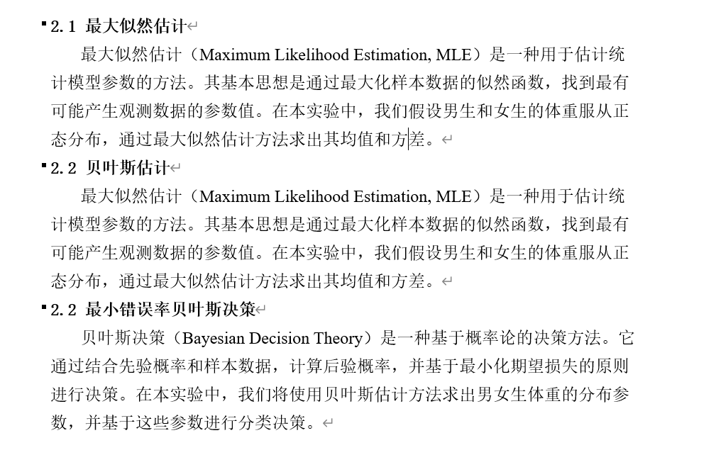

# AI_VI
 模式识别
<<<<<<< Updated upstream
=======

## 1.贝叶斯分类器

### **文书修改**

按照实验里的要求 写实验目的

### 实验原理加点公式

[[公式识别 (simpletex.cn)](https://simpletex.cn/ai/latex_ocr)]()

贝叶斯参数估计

最大后验参数估计

贝叶斯决策

### 数据来源

先验概率分布的 男女生体重身高平均值怎么得到？

[最新！我国男女平均身高和体重数据出炉！你及格了吗？_腾讯新闻 (qq.com)](https://new.qq.com/rain/a/20201223A066XX00)

[国家国民体质监测中心发布《第五次国民体质监测公报》_国家体育总局 (sport.gov.cn)](https://www.sport.gov.cn/n315/n329/c24335066/content.html)

### 实验结论（继续修改）

### 

三点结论：

1、男女生的直方图分布近似符合正态

2、最大似然估计的参数，贝叶斯估计假设先验方差下的参数估计

3、贝叶斯决策，选取什么样的先验分布，给一个测试样本分类的结果

### 代码

使用重新注释整理过的代码
>>>>>>> Stashed changes
